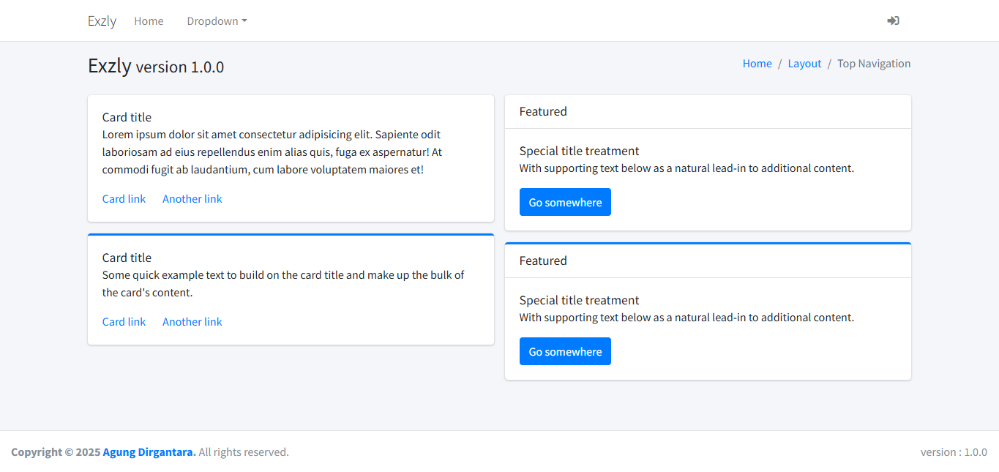
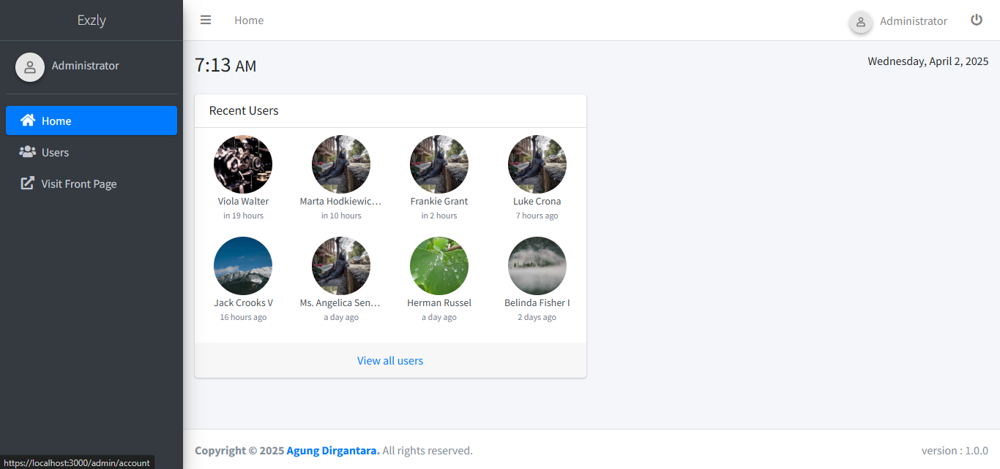
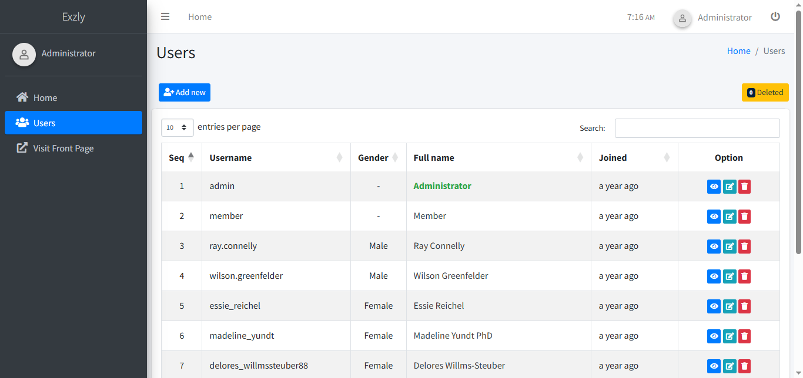

<p align="center">
  
</p>

<h1 align="center">Exzly</h1>
<h4 align="center">Enterprise-Grade Starter Kit for Express.js Monolithic Applications</h4>

## 📖 Description

**Exzly is an enterprise-grade starter kit for Express.js Monolithic Applications**, designed to help teams build scalable, maintainable monolithic apps — **fast and smart**.

With a robust architecture, built-in features, and production-ready configuration, Exzly accelerates development without compromising quality. It’s ideal for building internal tools, admin panels, business dashboards, or custom backend services.

Whether you're creating a business platform, a complex service, or a company-grade application, Exzly offers a flexible and extensible foundation tailored to enterprise needs.

## 📚 Table of Contents

- [📖 Description](#-description)
- [📚 Table of Contents](#-table-of-contents)
- [📸 Preview UI Screenshots](#-preview-ui-screenshots)
- [✨ Features](#-features)
- [🔧 Tech Stack](#-tech-stack)
- [📂 Project Structure](#-project-structure)
- [🏁 Getting Started](#-getting-started)
  - [Environment Setup](#environment-setup)
  - [Security Settings](#security-settings)
- [🌱 Migration and Seeder](#-migration-and-seeder)
- [🧹 Linter and Formatter](#-linter-and-formatter)
- [🚀 Running the Project](#-running-the-project)
- [🧪 Running Tests](#-running-tests)
- [👤 Default Account](#-default-account)
- [📄 License](#-license)

## 📸 Preview UI Screenshots

Here's a glimpse of what Exzly looks like out of the box:

<p align="center">Home Page and Login Page</p>
<p align="center">
   
  
</p>

<p align="center">Administrator Dashboard and User Management</p>
<p align="center">
   
  
</p>

## ✨ Features

- [x] 🧩 **Extensible & Scalable**  
       Built to adapt - easily extendable to match a wide range of use cases, from internal tools to enterprise platforms.

- [x] 🛡️ **Security Best Practices**  
       Pre-configured with security essentials like Helmet and CORS, making your app safer from day one.

- [x] ⚙️ **Database Migration & Seeding**  
       Manage database versions and development data using built-in migration and seeding scripts.

- [x] 🧪 **Integrated Testing Environment**  
       Includes out-of-the-box unit and API testing setup using Jest, with support for coverage tracking and CI pipelines.

- [x] 📦 **Modular Monolithic Architecture**  
       Clean and modular structure within a monolithic design - easy to scale and maintain over time.

- [x] 🛠️ **Optimized Developer Experience**  
       Equipped with ESLint, Prettier, Husky, and structured commit hooks to ensure a clean and consistent codebase.

- [x] 🔄 **CI/CD Ready**
      Seamlessly integrates with continuous integration and deployment workflows, enabling faster and more reliable shipping cycles.

- [x] 🚀 **Production-Ready Configuration**  
       Pre-configured for production environments, with linting, testing, environment management, and database seeding out of the box.

- [x] 📁 **Clear & Maintainable Project Structure**  
       A well-organized file structure that’s intuitive and scalable for teams of any size.

- [x] 🔐 **Built-in Authentication & User Management**  
       Includes a ready-to-use authentication system with user role management - no need to build it from scratch.

## 🔧 Tech Stack

Exzly is built using modern, battle-tested technologies that prioritize performance, maintainability, and developer experience.

- View engine: using [Nunjucks](https://mozilla.github.io/nunjucks/)
- Database ORM: using [Sequelize](https://sequelize.org/)
- Authentication: using [jsonwebtoken](https://github.com/auth0/node-jsonwebtoken)
- Session: using [express-session](https://github.com/expressjs/session)
- Session store: using [session-file-store](https://github.com/valery-barysok/session-file-store)
- Environment variable: using [dotenv](https://github.com/motdotla/dotenv)
- Editor config: using [EditorConfig](https://editorconfig.org/)
- Security headers: using [helmet](https://helmetjs.github.io/)
- CORS: using [cors](https://github.com/expressjs/cors)
- Rate limiter: using [express-rate-limit](https://github.com/nfriedly/express-rate-limit)
- File validation: using [file-type](https://github.com/sindresorhus/file-type)
- Hashing: using [crypto-js](https://github.com/brix/crypto-js)
- Validation: using [express-validator](https://express-validator.github.io/)
- Compression: using [compression](https://github.com/expressjs/compression)
- Logging: using [morgan](https://github.com/expressjs/morgan) and [winston](https://github.com/winstonjs/winston)
- Debugging: using [debug](https://github.com/debug-js/debug)
- Email: using [Nodemailer](https://nodemailer.com/)
- Testing: using [Jest](https://jestjs.io/)
- Linting & formatting: using [ESLint](https://eslint.org/) and [Prettier](https://prettier.io/)
- Git hooks: using [husky](https://typicode.github.io/husky) and [lint-staged](https://github.com/okonet/lint-staged)

    

## 📂 Project Structure

```text
- database/                # Database-related files
  ├─ migrations/           # Sequelize migration files
  └─ seeders/              # Sequelize seeder files
- public/                  # Static assets (images, CSS, JS for frontend)
- src/                     # Main source code
  ├─ config/               # App configuration (security, module, etc.)
  ├─ helpers/              # Helper functions and utilities
  ├─ middlewares/          # Express middleware (auth, error handling, etc.)
  ├─ models/               # Sequelize models
  ├─ routes/               # Route definitions
  │  ├─ admin/             # Routes for admin panel
  │  ├─ api/               # RESTful API routes
  │  └─ web/               # Web (frontend) routes
  ├─ utils/                # Utility modules (e.g., logger, debugger, JWT)
  ├─ validators/           # Request validation using express-validator
  └─ views/                # Nunjucks templates
     ├─ admin/             # Nunjucks templates for admin views
     ├─ email/             # Templates for email
     └─ web/               # Public site templates
```

## 🏁 Getting Started

To get started with Exzly, follow the steps below:

1. Clone this repository:

   ```bash
   git clone https://github.com/agoenks29D/exzly.git
   ```

2. Duplicate the example `.env` file to create your configuration file:

   ```bash
   cp .env.example .env
   ```

   For a detailed explanation of environment variables, refer to [Environment Setup](#environment-setup).

3. Run the following command to install the required packages:

   ```bash
   npm install
   ```

4. Configure the database settings in the [`/database/config.json`](/database/config.json) file according to your environment.

5. Before starting the application, you need to set up the database. You can choose between demo data (for development) or production-ready setup. See more options in the [Migration and Seeder](#-migration-and-seeder) section.

6. Now, you're ready to run the app! refer to the 👉 [Running the Project](#-running-the-project) section.

### Environment Setup

Below is the list of environment variables that need to be configured in the `.env` file:

| **Variable**         | **Description**                                                                                            | **Example Value**                 | **Actions secrets and variables** |
| -------------------- | ---------------------------------------------------------------------------------------------------------- | --------------------------------- | --------------------------------- |
| `TZ`                 | Time zone setting                                                                                          | `UTC`                             | `variable`                        |
| `PORT`               | Port number for the application to listen on                                                               | `3000`                            | `secret`                          |
| `DEBUG`              | Environment variable for debugging and logging                                                             | `express.*`                       | `variable`                        |
| `APP_NAME`           | Name of the application                                                                                    | `Exzly`                           | `variable`                        |
| `NODE_ENV`           | The environment the app is running in (e.g., development, production)                                      | `development`                     | `variable`                        |
| `TRUST_PROXY`        | Trust proxy setting (1 enables trust)                                                                      | `1`                               | `secret`                          |
| `STORAGE_PATH`       | Path to storage folder                                                                                     | `storage`                         | `secret`                          |
| `SESSION_SECRET`     | Secret key used for session management                                                                     | `Exzly`                           | `secret`                          |
| `SESSION_EXPIRATION` | Session expiration time                                                                                    | `4h`                              | `secret`                          |
| **HTTPS**            |                                                                                                            |                                   |                                   |
| `ENABLE_HTTPS`       | Enable or disable HTTPS                                                                                    | `true`                            | `variable`                        |
| `SSL_KEY_FILE`       | Path to the SSL key file for HTTPS                                                                         | `PATH/TO/SSL_KEY_FILE.key`        | `secret`                          |
| `SSL_CERT_FILE`      | Path to the SSL certificate file                                                                           | `PATH/TO/SSL_CERT_FILE.crt`       | `secret`                          |
| **Database**         |                                                                                                            |                                   |                                   |
| `DB_SYNC`            | Enable or disable database sync                                                                            | `true`                            | `variable`                        |
| `DB_MODE`            | Mode for database synchronization: alter (non-destructive changes), force (drops and recreates all tables) | `alter`                           | `variable`                        |
| `DATABASE_NAME`      | Name of the database                                                                                       | `exzly_development`               | `secret`                          |
| `DATABASE_USER`      | Username used to connect to the database                                                                   | `root`                            | `secret`                          |
| `DATABASE_PASS`      | Password for the database user                                                                             | _(leave blank if not needed)_     | `secret`                          |
| `DATABASE_HOST`      | Host address of the database server                                                                        | `localhost`                       | `secret`                          |
| `DATABASE_TIME`      | Timezone offset for the database connection                                                                | `+00:00`                          | `secret`                          |
| `DATABASE_DIALECT`   | Type of SQL dialect used (e.g., mysql, postgres)                                                           | `mysql`                           | `secret`                          |
| `DATABASE_CONFIG`    | Configuration file for advanced DB settings                                                                | `config.js` or `config.json`      | `secret`                          |
| **Security: JWT**    |                                                                                                            |                                   |                                   |
| `JWT_SECRET`         | Secret key for JWT authentication                                                                          | `Exzly`                           | `secret`                          |
| `JWT_EXPIRATION`     | JWT expiration time                                                                                        | `4h`                              | `secret`                          |
| **SMTP**             |                                                                                                            |                                   |                                   |
| `SMTP_PORT`          | SMTP port                                                                                                  | `587`                             | `secret`                          |
| `SMTP_HOST`          | SMTP server host                                                                                           | `sandbox.smtp.mailtrap.io`        | `secret`                          |
| `SMTP_FROM`          | From email address used in SMTP                                                                            | `No Reply <no-reply@example.com>` | `secret`                          |
| `SMTP_USER`          | SMTP username                                                                                              | `db71a9eabfxxxx`                  | `secret`                          |
| `SMTP_PASS`          | SMTP password                                                                                              | `74606e0fa9xxxx`                  | `secret`                          |
| **Routes**           |                                                                                                            |                                   |                                   |
| `WEB_ROUTE`          | Base route for web pages                                                                                   | `/`                               | `secret`                          |
| `API_ROUTE`          | Base route for API endpoints                                                                               | `/api`                            | `secret`                          |
| `ADMIN_ROUTE`        | Base route for admin panel                                                                                 | `/admin`                          | `secret`                          |

### Security Settings

Modify the security configurations in the [`/src/config/security.js`](/src/config/security.js) file.

## 🌱 Migration and Seeder

Handle database migrations and seeders as follows:

- **Run all migrations and seeders for development:**

  ```bash
  npm run db:demo
  ```

- **Run all migrations and seeders for production:**

  ```bash
  npm run db:start
  ```

  This command ensures no fake data is generated.

- **Run all migration files:**

  ```bash
  npx sequelize-cli db:migrate --name all.js
  ```

- **Run a specific migration:**

  ```bash
  npx sequelize-cli db:migrate --name base.js
  ```

- **Run specific seeders:**

  - Start seeder (used for production, no fake data):

    ```bash
    npx sequelize-cli db:seed --seed start
    ```

  - Demo seeder (includes fake data for testing purposes):

    ```bash
    npx sequelize-cli db:seed --seed demo
    ```

## 🧹 Linter and Formatter

Keep your code clean and consistent by using the following commands:

- **Run linter:**

  ```bash
  npm run lint
  ```

- **Run formatter:**

  ```bash
  npm run format
  ```

## 🚀 Running the Project

Run the project in the desired mode:

- **Production mode:**

  ```bash
  npm start
  ```

- **Development mode:**

  ```bash
  npm run start:dev
  ```

## 🧪 Running Tests

Exzly comes with an integrated testing environment using Jest. This setup is ready out of the box and supports both unit and API tests.

Run all tests:

```bash
npm test
```

Run a specific test suite

```bash
npm test -- <test_suite_name>
```

Run test coverage

```bash
npm run test:cov
```

## 👤 Default Account

| Email                | Username             | Password | Role          |
| -------------------- | -------------------- | -------- | ------------- |
| admin@exzly.dev      | admin                | admin    | Administrator |
| member@exzly.dev     | member               | member   | Member        |
| _Generated by Faker_ | _Generated by Faker_ | member   | Member        |

## 📄 License

Exzly is distributed under the [MIT License](./LICENSE).
